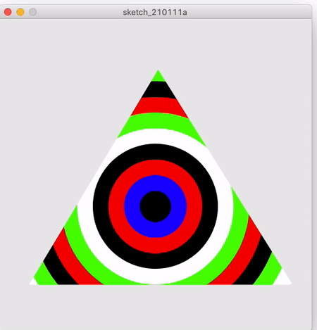

# triangledCircles

An OpenProcessing project to draw moving circles beneath a triangle. Mouse clicking starts to move the circles outside of the triangle and rings the relevant sound related to colors which touches the triangle's boundries.

